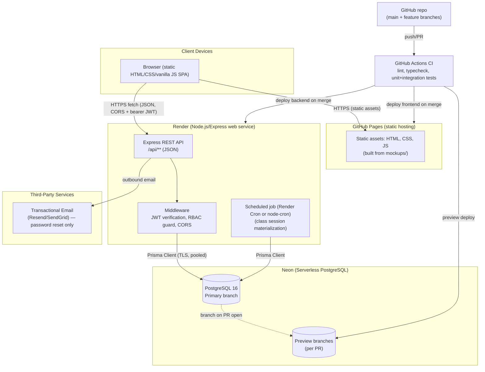
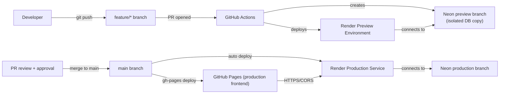
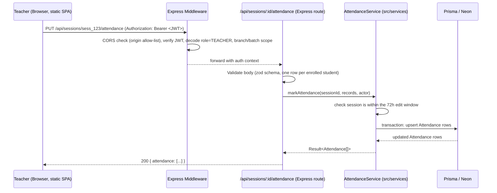
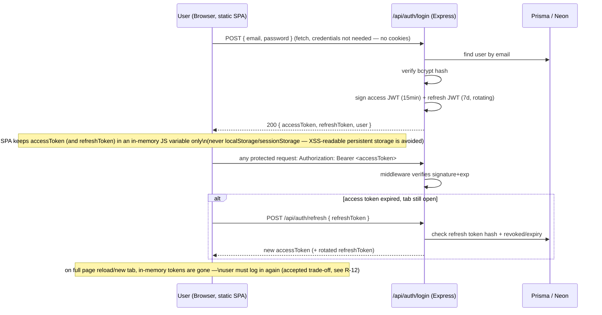

# Architecture Document

## Tuition Center Management System (TCMS)

|         |                                                                                                                    |
| ------- | ------------------------------------------------------------------------------------------------------------------ |
| Version | 2.0 (Reworked 2026-09-14 — decoupled architecture)                                                                 |
| Status  | **APPROVED**                                                                                                       |
| Related | [01-srs.md](./01-srs.md) · [03-database-design.md](./03-database-design.md) · [09-review-qa.md](./09-review-qa.md) |

> **Supersedes v1.0**: `Prompt.txt`'s original diagram showed a Next.js monolith. The product owner confirmed on 2026-09-14 (after briefly confirming the monolith, then reversing) that the real requirement is a **decoupled static frontend + separate API backend**, because the frontend must be hostable as static files on GitHub (Pages). This version reflects that decision — see [09-review-qa.md](./09-review-qa.md) R-00.

---

## 1. Architectural Style

**Decoupled static SPA + separate REST API service.** The frontend is a static HTML/CSS/vanilla-JS single-page app (no build step, no framework — evolved directly from the `mockups/` screens) deployed to **GitHub Pages**. The backend is a standalone **Node.js + Express** REST API deployed to **Render**, talking to **Neon PostgreSQL** via Prisma. The two are entirely separate deployments on separate origins, communicating only over HTTPS/JSON.

### Why decoupled, not a monolith

| Consideration                              | Decoupled SPA + API (chosen)                                           | Monolith (Next.js)                                     |
| ------------------------------------------ | ---------------------------------------------------------------------- | ------------------------------------------------------ |
| Matches product owner's actual requirement | Yes — static files on GitHub Pages, API elsewhere                      | No — needs a Node server, can't be pure static hosting |
| Deployment                                 | 2 deployments (GitHub Pages + Render), independently deployable        | 1 Vercel project, simpler but coupled                  |
| Auth cookie/token handling                 | Cross-origin — needs CORS + bearer tokens (or `SameSite=None` cookies) | Same-origin, simpler                                   |
| Team size (small center, few devs)         | Slightly more moving parts, still manageable at this scale             | Lower operational overhead                             |
| Hosting cost                               | GitHub Pages is free; Render has a free/hobby tier                     | Vercel has a generous free tier too                    |

**Trade-off accepted**: cross-origin auth is more complex than same-origin cookies (see §5). The product owner explicitly chose bearer JWTs held in memory (re-login required after a full page reload) over the complexity of cross-site cookies, given this is acceptable for a small center's usage pattern.

---

## 2. System Context Diagram

### Component responsibilities

| Component                        | Responsibility                                                                                                                                                                                                     |
| -------------------------------- | ------------------------------------------------------------------------------------------------------------------------------------------------------------------------------------------------------------------ |
| Static SPA (GitHub Pages)        | Plain HTML/CSS/vanilla JS pages (evolved from `mockups/`); client-side routing between pages, `fetch()` calls to the API for all data; no server-side rendering.                                                   |
| Express REST API (Render)        | Full REST surface consumed by the SPA; enforces auth + business logic; only entry point to the database.                                                                                                           |
| Middleware (Express)             | Verifies the bearer JWT on every request to a protected route; attaches `{ userId, role, branchIds }` to the request context; returns 401/403 early; applies a strict CORS allow-list for the GitHub Pages origin. |
| Service layer (`src/services/*`) | Business logic (enrollment capacity checks, scheduling overlap checks, attendance rules) — single source of truth, unit-testable in isolation from HTTP.                                                           |
| Prisma Client                    | Typed DB access; schema is the single source of truth for the DB shape ([03-database-design.md](./03-database-design.md)).                                                                                         |
| Neon PostgreSQL                  | Primary data store; branching used for CI/preview environments so tests never touch production data.                                                                                                               |
| Scheduled job                    | Materializes upcoming `ClassSession` rows from `ClassSchedule` (see FR-ATT-1); run via Render's cron feature or an in-process `node-cron` scheduler.                                                               |
| GitHub Actions                   | CI gate: ESLint, `tsc --noEmit`, unit tests, integration tests (against a Neon preview branch) before merge; deploys frontend to Pages and backend to Render.                                                      |

---

## 3. Deployment Topology

- **Environments**: `local` (developer machine, `.env.local` + Neon dev branch or local Postgres, frontend served via a static file server), `preview` (per-PR, Neon branch + Render preview URL; frontend preview optional via a PR-specific `gh-pages` subfolder or just tested locally against the preview API), `production` (`main` branch, Neon default branch, GitHub Pages custom/`github.io` domain + Render production service).
- **Secrets**: `DATABASE_URL`, `JWT_ACCESS_SECRET`, `JWT_REFRESH_SECRET`, `EMAIL_API_KEY` (password-reset emails only) stored in Render's environment variables — never committed to Git, never shipped to the static frontend (see [09-review-qa.md](./09-review-qa.md) security checklist). The frontend has **no secrets at all** — it only knows the API's base URL.
- **Migrations**: `prisma migrate deploy` run as a Render pre-deploy/release step against the target branch's database before the new API version receives traffic.

---

## 4. Request Lifecycle (example: Teacher marks attendance for a session)

---

## 5. Authentication & Authorization Flow

**Why bearer JWT in memory, not cookies**: the frontend (`*.github.io`) and API (`*.onrender.com`) are on different top-level domains, so same-site cookies don't work at all, and cross-site cookies (`SameSite=None; Secure`) need careful CORS-with-credentials configuration and are increasingly restricted by browsers (e.g. Safari ITP). The product owner chose the simpler bearer-token-in-memory model instead: no CSRF exposure (no ambient cookie sent automatically), at the cost of requiring re-login after a full page reload. This is a deliberate, accepted trade-off (R-12), not an oversight.

---

## 6. Cross-Cutting Concerns

| Concern              | Approach                                                                                                                                                                                                          |
| -------------------- | ----------------------------------------------------------------------------------------------------------------------------------------------------------------------------------------------------------------- |
| Validation           | `zod` schemas on the API side (source of truth per endpoint); the SPA does light client-side validation for UX only, never trusted.                                                                               |
| Error handling       | Central `AppError` class (`code`, `httpStatus`, `message`) caught by an Express error-handling middleware → consistent JSON error shape (see [04-api-specification.md](./04-api-specification.md) §Error format). |
| Logging              | Structured JSON logs (pino) to stdout, captured by Render's log stream; no PII (passwords, full card numbers) ever logged.                                                                                        |
| Rate limiting        | IP+account based limiter (e.g., `express-rate-limit` + Upstash Redis, or in-memory fallback for a single Render instance) on `/api/auth/*` to mitigate brute force (FR-AUTH-6).                                   |
| Multi-branch scoping | Every Prisma query for non-Super-Admin roles is passed through a `scopeToBranches(ctx)` helper that injects a `branchId IN (...)` filter — prevents accidental cross-branch data leaks.                           |
| CORS                 | API allow-lists the exact GitHub Pages origin(s) (production + any preview origins used for testing); credentials mode not needed since auth is bearer-token, not cookie-based.                                   |
| Background jobs      | Render cron (or in-process `node-cron`) hitting an internal service function directly (not over HTTP), guarded by process-level trust since it's not a client-facing endpoint.                                    |
| Observability        | A `/api/health` endpoint checking DB connectivity for uptime monitors (e.g. UptimeRobot pinging it to mitigate Render free-tier cold starts).                                                                     |

---

## 7. Risks Introduced by This Architecture

See [09-review-qa.md](./09-review-qa.md) for the full register; architecture-specific ones:

- **R-02 (Neon cold start)**: serverless Postgres can add latency after idle; mitigated with Neon's connection pooling (`pgbouncer` mode) and Prisma's connection reuse, documented as an accepted trade-off in NFR-1.
- **R-12 (bearer-token-in-memory reload UX)**: full page reload forces re-login; accepted trade-off, see §5.
- **R-13 (Render cold start)**: free/hobby-tier Render services sleep after inactivity, adding latency to the first request after idle; mitigated with an uptime-monitor ping or a paid always-on tier if it becomes a problem.
- **R-14 (CORS misconfiguration)**: must never combine a wildcard `Access-Control-Allow-Origin` with credentialed requests; not applicable here since auth is bearer-token (no cookies), but the allow-list must still be exact-origin, not wildcard, to prevent any site from calling the API using a stolen/leaked token in a browser context.

---

## 8. Approval Gate

This architecture (v2.0, decoupled) was approved by the product owner on 2026-09-14, superseding the v1.0 monolith design (see [00-index.md](./00-index.md)).
