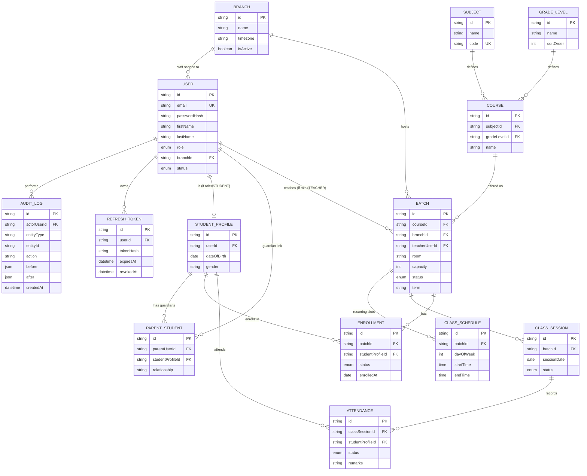

# Database Design

## Tuition Center Management System (TCMS)

|         |                                                                                                                              |
| ------- | ---------------------------------------------------------------------------------------------------------------------------- |
| Version | 1.0 (Draft — pending approval)                                                                                               |
| Status  | **AWAITING SIGN-OFF**                                                                                                        |
| Related | [01-srs.md](./01-srs.md) · [02-architecture.md](./02-architecture.md) · [04-api-specification.md](./04-api-specification.md) |

> **Note on existing seeded data**: a lightweight prototype schema (`classes`, `teachers`, `students`, `schedule` — Drizzle-managed, no auth/fees/exams) already exists and was seeded from `tuition_school_dummy_data.xlsx` in the Neon project `TuitionCenter` (`steep-pine-14221605`) during an earlier ad-hoc request. That schema is a **subset prototype**, not this design. The schema below is the full enterprise design called for by the SRS; when implementation starts, migrate/import that prototype's rows into the equivalent `Course`/`Teacher`/`Student`/`ClassSchedule` tables below rather than discarding them (see [08-implementation-plan.md](./08-implementation-plan.md) Module M2 task "seed-data import").

---

## 1. Design Principles (WHY)

| Decision                                                                        | Rationale                                                                                                                                              | Risk if ignored                                                                                                                                                        |
| ------------------------------------------------------------------------------- | ------------------------------------------------------------------------------------------------------------------------------------------------------ | ---------------------------------------------------------------------------------------------------------------------------------------------------------------------- |
| Enum-based static roles (`Role` enum on `User`), not a dynamic RBAC engine      | Tuition-center roles are small, well-known, and rarely change; a dynamic permission engine is speculative complexity for a v1 with no evidence of need | If future customers need per-user custom permissions, this needs a migration to a `Role`/`Permission` join-table model (documented as a deliberate v2 seam, not a gap) |
| Separate `Branch` entity even for a single-branch center today                  | Tuition centers commonly expand to multiple locations; retrofitting branch-scoping into every table later touches nearly every query                   | Slight upfront modeling overhead; mitigated by defaulting to one seeded Branch row                                                                                     |
| `ClassSession` materialized rows (not computed on the fly from `ClassSchedule`) | Attendance needs a stable row to attach records to, including ad-hoc/rescheduled sessions that deviate from the recurring pattern                      | Computing sessions on the fly makes historical attendance non-editable/non-auditable once a recurring schedule changes                                                 |
| Soft status enums (`ACTIVE`/`WITHDRAWN`/etc.) instead of deleting rows          | Attendance/audit history must be retained even after a student leaves                                                                                  | Hard deletes would break historical reports and violate NFR-9 auditability                                                                                             |
| `AuditLog` as an append-only table with no FK cascade deletes into it           | Audit trail must survive deletion of the entity it describes                                                                                           | Cascading deletes would silently erase compliance evidence                                                                                                             |

---

## 2. Entity-Relationship Diagram



---

## 3. Table Catalogue (summary)

| Table                   | Purpose                                                        | Key constraints                                                                                                                       |
| ----------------------- | -------------------------------------------------------------- | ------------------------------------------------------------------------------------------------------------------------------------- |
| `Branch`                | Physical/operating location                                    | unique `name` per center                                                                                                              |
| `User`                  | All human accounts (staff + teacher + student + parent)        | unique `email`; `role` enum                                                                                                           |
| `StudentProfile`        | Student-specific attributes, 1:1 with a `User` of role STUDENT | unique `userId`                                                                                                                       |
| `ParentStudent`         | Many-to-many guardian ↔ student link                           | unique (`parentUserId`,`studentProfileId`)                                                                                            |
| `Subject`, `GradeLevel` | Academic taxonomy                                              | unique `code`/`name`                                                                                                                  |
| `Course`                | Subject × GradeLevel offering definition                       | unique (`subjectId`,`gradeLevelId`)                                                                                                   |
| `Batch`                 | Scheduled instance of a Course (a "class")                     | FK teacher must have role TEACHER (app-level check)                                                                                   |
| `ClassSchedule`         | Recurring weekly slot for a Batch                              | no overlapping (teacherId/room, dayOfWeek, time range) within a Branch — enforced in service layer + DB exclusion constraint (see §5) |
| `ClassSession`          | Concrete dated occurrence of a Batch                           | unique (`batchId`,`sessionDate`)                                                                                                      |
| `Enrollment`            | Student ↔ Batch membership                                     | unique (`studentProfileId`,`batchId`)                                                                                                 |
| `Attendance`            | Per-student per-session record                                 | unique (`classSessionId`,`studentProfileId`)                                                                                          |
| `AuditLog`              | Immutable audit trail                                          | append-only, no update/delete API                                                                                                     |
| `RefreshToken`          | JWT refresh-token rotation store                               | hashed token, not raw                                                                                                                 |

---

## 4. Prisma Schema (design artifact — implementation will diff against this, not code from scratch)

```prisma
// prisma/schema.prisma
generator client {
  provider = "prisma-client-js"
}

datasource db {
  provider = "postgresql"
  url      = env("DATABASE_URL")
}

enum Role {
  SUPER_ADMIN
  CENTER_ADMIN
  ACCOUNTANT
  TEACHER
  STUDENT
  PARENT
}

enum UserStatus {
  PENDING
  ACTIVE
  SUSPENDED
  DEACTIVATED
}

enum EnrollmentStatus {
  ACTIVE
  COMPLETED
  WITHDRAWN
}

enum SessionStatus {
  SCHEDULED
  COMPLETED
  CANCELLED
}

enum AttendanceStatus {
  PRESENT
  ABSENT
  LATE
  EXCUSED
}

enum BatchStatus {
  ACTIVE
  ARCHIVED
}

model Branch {
  id        String   @id @default(cuid())
  name      String   @unique
  timezone  String   @default("Asia/Colombo")
  isActive  Boolean  @default(true)
  createdAt DateTime @default(now())

  users    User[]
  batches  Batch[]
}

model User {
  id           String     @id @default(cuid())
  email        String     @unique
  passwordHash String
  firstName    String
  lastName     String
  phone        String?
  role         Role
  status       UserStatus @default(PENDING)
  branchId     String?
  branch       Branch?    @relation(fields: [branchId], references: [id])
  createdAt    DateTime   @default(now())
  updatedAt    DateTime   @updatedAt

  studentProfile     StudentProfile?
  taughtBatches       Batch[]          @relation("BatchTeacher")
  guardianOf          ParentStudent[]  @relation("ParentLink")
  auditLogs           AuditLog[]
  refreshTokens       RefreshToken[]

  @@index([role, branchId])
}

model StudentProfile {
  id          String   @id @default(cuid())
  userId      String   @unique
  user        User     @relation(fields: [userId], references: [id])
  dateOfBirth DateTime?
  gender      String?

  guardians    ParentStudent[]
  enrollments  Enrollment[]
  attendances  Attendance[]
}

model ParentStudent {
  id               String         @id @default(cuid())
  parentUserId     String
  parent           User           @relation("ParentLink", fields: [parentUserId], references: [id])
  studentProfileId String
  student          StudentProfile @relation(fields: [studentProfileId], references: [id])
  relationship     String?

  @@unique([parentUserId, studentProfileId])
}

model Subject {
  id   String @id @default(cuid())
  name String
  code String @unique

  courses Course[]
}

model GradeLevel {
  id        String @id @default(cuid())
  name      String @unique
  sortOrder Int

  courses Course[]
}

model Course {
  id           String     @id @default(cuid())
  subjectId    String
  subject      Subject    @relation(fields: [subjectId], references: [id])
  gradeLevelId String
  gradeLevel   GradeLevel @relation(fields: [gradeLevelId], references: [id])
  name         String

  batches Batch[]

  @@unique([subjectId, gradeLevelId])
}

model Batch {
  id             String      @id @default(cuid())
  courseId       String
  course         Course      @relation(fields: [courseId], references: [id])
  branchId       String
  branch         Branch      @relation(fields: [branchId], references: [id])
  teacherUserId  String?
  teacher        User?       @relation("BatchTeacher", fields: [teacherUserId], references: [id])
  room           String
  capacity       Int
  term           String
  status         BatchStatus @default(ACTIVE)
  createdAt      DateTime    @default(now())

  schedules     ClassSchedule[]
  sessions      ClassSession[]
  enrollments   Enrollment[]

  @@index([branchId, status])
}

model ClassSchedule {
  id        String   @id @default(cuid())
  batchId   String
  batch     Batch    @relation(fields: [batchId], references: [id])
  dayOfWeek Int      // 0=Sunday .. 6=Saturday
  startTime String   // "HH:mm", stored as text; validated by app layer
  endTime   String

  @@index([batchId])
}

model ClassSession {
  id          String        @id @default(cuid())
  batchId     String
  batch       Batch         @relation(fields: [batchId], references: [id])
  sessionDate DateTime
  status      SessionStatus @default(SCHEDULED)

  attendances Attendance[]

  @@unique([batchId, sessionDate])
}

model Enrollment {
  id               String           @id @default(cuid())
  batchId          String
  batch            Batch            @relation(fields: [batchId], references: [id])
  studentProfileId String
  student          StudentProfile   @relation(fields: [studentProfileId], references: [id])
  status           EnrollmentStatus @default(ACTIVE)
  enrolledAt       DateTime         @default(now())

  @@unique([batchId, studentProfileId])
}

model Attendance {
  id               String           @id @default(cuid())
  classSessionId   String
  classSession     ClassSession     @relation(fields: [classSessionId], references: [id])
  studentProfileId String
  student          StudentProfile   @relation(fields: [studentProfileId], references: [id])
  status           AttendanceStatus
  remarks          String?
  markedAt         DateTime         @default(now())

  @@unique([classSessionId, studentProfileId])
}

model AuditLog {
  id           String   @id @default(cuid())
  actorUserId  String
  actor        User     @relation(fields: [actorUserId], references: [id])
  entityType   String
  entityId     String
  action       String
  before       Json?
  after        Json?
  ipAddress    String?
  createdAt    DateTime @default(now())

  @@index([entityType, entityId])
}

model RefreshToken {
  id         String    @id @default(cuid())
  userId     String
  user       User      @relation(fields: [userId], references: [id])
  tokenHash  String    @unique
  expiresAt  DateTime
  revokedAt  DateTime?
  createdAt  DateTime  @default(now())
}
```

---

## 5. Integrity Rules Beyond Prisma's Reach (enforced in service layer + targeted DB constraints)

| Rule                                                                              | Enforcement                                                                                                                                                                                                                                                                                                                                                                                         |
| --------------------------------------------------------------------------------- | --------------------------------------------------------------------------------------------------------------------------------------------------------------------------------------------------------------------------------------------------------------------------------------------------------------------------------------------------------------------------------------------------- |
| No teacher/room double-booking for overlapping `ClassSchedule` in the same Branch | Postgres `EXCLUDE USING gist` constraint on (`teacherUserId`/`room`, `dayOfWeek`, time range) added via a raw SQL migration alongside the Prisma-managed tables, **or** service-layer check inside a serializable transaction if `btree_gist` extension isn't available on the plan — decision recorded during Module M2 implementation ([08-implementation-plan.md](./08-implementation-plan.md)). |
| Enrollment ≤ Batch.capacity                                                       | Service layer: count active enrollments in the same transaction as insert (`SELECT ... FOR UPDATE` or serializable isolation) before allowing a new `Enrollment`.                                                                                                                                                                                                                                   |
| Attendance edit window (72h)                                                      | Service layer compares `now() - classSession.sessionDate`; violations require an `AuditLog`-flagged admin override path.                                                                                                                                                                                                                                                                            |

---

## 6. Indexing & Performance Notes

- Composite index on (`branchId`, `status`) for `Batch` backs the highest-traffic dashboard query (active batches per branch).
- `AuditLog(entityType, entityId)` supports "show history for this record" without a full-table scan.
- All FK columns get an implicit btree index via Prisma's relation scalar fields; verified against `unused-indexes`/`seq-scans` Neon diagnostics after go-live (see Deployment Checklist in [08-implementation-plan.md](./08-implementation-plan.md)).

---

## 7. Approval Gate

This Database Design must be approved together with [01-srs.md](./01-srs.md) and [02-architecture.md](./02-architecture.md) before any `prisma migrate` is run against a real environment or application code is generated.
