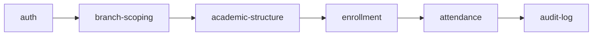

# Software Design Document (SDD)

## Tuition Center Management System (TCMS)

|         |                                                                                                                                                                                 |
| ------- | ------------------------------------------------------------------------------------------------------------------------------------------------------------------------------- |
| Version | 1.0 (Draft — pending approval)                                                                                                                                                  |
| Format  | OpenSpec-style capability specs — each capability is independently reviewable/versionable and traces back to SRS `FR-*` IDs                                                     |
| Related | [01-srs.md](./01-srs.md) · [02-architecture.md](./02-architecture.md) · [03-database-design.md](./03-database-design.md) · [04-api-specification.md](./04-api-specification.md) |

---

## How to read this document

Each **Capability** below is a self-contained spec unit (an "OpenSpec change" once implementation begins) with:

- **Why** — the design rationale
- **Requirements** — testable `SHALL` statements
- **Scenarios** — concrete Given/When/Then behavior, including edge/failure cases
- **Depends on** — other capabilities this one assumes exist

This mirrors OpenSpec's spec-driven-development shape (capability → requirement → scenario) so that, at implementation time, each capability becomes its own reviewable change proposal against a living `specs/` tree rather than one monolithic design doc that drifts from the code.

---

## Capability: `auth`

### Why

JWT bearer tokens (held in memory by the SPA, never persisted to localStorage/cookies) were chosen over httpOnly cookies because the frontend (GitHub Pages) and API (Render) are on different top-level domains — cross-site cookies add CORS/`SameSite=None` complexity and browser restrictions that bearer tokens avoid entirely. The trade-off (full page reload forces re-login) was explicitly accepted by the product owner (see [02-architecture.md](./02-architecture.md) v2.0 §5, risk R-12).

### Requirements

- The system **SHALL** hash passwords with bcrypt (cost factor ≥ 12) before persisting.
- The system **SHALL** issue an access token (15 min TTL) and a refresh token (7 day TTL, rotated on each use) on successful login.
- The system **SHALL** reject login after 5 consecutive failures per (email, IP) for 15 minutes.
- The system **SHALL** require email verification or admin approval before a self-registered account can log in.

### Scenarios

**Scenario: Successful login**

- GIVEN an ACTIVE user with a known password
- WHEN they POST `/api/auth/login` with correct credentials
- THEN the response is 200 with `{ accessToken, refreshToken, user }` in the JSON body (no cookies set)

**Scenario: Login blocked by brute-force guard**

- GIVEN 5 failed login attempts for `parent@example.com` from the same IP within 15 minutes
- WHEN a 6th attempt is made with the correct password
- THEN the response is 429 `RATE_LIMITED`, and the correct password is still rejected until the window expires

**Scenario: Pending self-registration cannot log in**

- GIVEN a Parent who self-registered and has `status=PENDING`
- WHEN they attempt to log in with correct credentials
- THEN the response is 403 with a message directing them to await admin approval (not a generic "invalid credentials", so the user isn't confused into resetting a working password)

### Depends on

None (foundational).

---

## Capability: `branch-scoping`

### Why

Every non-Super-Admin role must be confined to their assigned branch(es) at the data-access layer, not just the UI, to prevent IDOR-style cross-branch data leaks (OWASP A01).

### Requirements

- Every Prisma query issued on behalf of a `CENTER_ADMIN`/`ACCOUNTANT`/`TEACHER` **SHALL** pass through a `scopeToBranches(ctx)` helper injecting a `branchId IN (:assigned)` (or batch/teacher-ownership equivalent) filter.
- A request for a specific resource ID outside the caller's scope **SHALL** return 404, not 403 (see [04-api-specification.md](./04-api-specification.md) §1.2).

### Scenarios

**Scenario: Cross-branch fetch blocked**

- GIVEN Center Admin `A` is scoped only to Branch "Colombo"
- WHEN `A` requests `GET /api/batches/:id` for a batch belonging to Branch "Kandy"
- THEN the response is 404 `NOT_FOUND`

### Depends on

`auth`

---

## Capability: `academic-structure`

_(Subjects, Grade Levels, Courses, Batches, Recurring Schedules — FR-ACAD-_)*

### Why

Modeling Course (a static curriculum definition) separately from Batch (a scheduled, teacher-assigned, term-bound offering) lets the same Course run as multiple concurrent Batches (e.g., two Primary-3 Math batches on different evenings) without duplicating subject/grade metadata.

### Requirements

- The system **SHALL** prevent creating a `ClassSchedule` that overlaps an existing schedule for the same teacher OR the same room within the same branch.
- The system **SHALL** allow a Batch to be archived, after which no new Enrollments or Sessions can be created against it.

### Scenarios

**Scenario: Teacher double-booking rejected**

- GIVEN Teacher `T003` already teaches a batch Mon/Wed 17:45–19:15 in Room A
- WHEN an Admin tries to schedule a different batch for `T003` on Wed 18:00–19:00 (overlapping)
- THEN the response is 409 `CONFLICT` and no schedule row is created

**Scenario: Room double-booking rejected even for different teachers**

- GIVEN Room A is booked Mon 16:00–17:30 for Teacher `T001`'s batch
- WHEN an Admin schedules Teacher `T005`'s batch in Room A Mon 17:00–18:00 (overlapping)
- THEN the response is 409 `CONFLICT`

**Scenario: Archived batch rejects new enrollment**

- GIVEN Batch `C006` has `status=ARCHIVED`
- WHEN an Accountant attempts `POST /api/enrollments` for `C006`
- THEN the response is 409 `CONFLICT`

### Depends on

`branch-scoping`

---

## Capability: `enrollment`

_(FR-ENR-_)*

### Why

Capacity enforcement must happen inside the same transaction as the insert to avoid a race condition where two concurrent enrollment requests both pass a capacity check before either commits (classic TOCTOU bug).

### Requirements

- The system **SHALL** reject an enrollment when active enrollment count already equals `Batch.capacity`.
- The system **SHALL** perform the capacity check and insert inside a single serializable (or row-locked) transaction.

### Scenarios

**Scenario: Concurrent enrollments at last seat**

- GIVEN Batch capacity is 20 and 19 ACTIVE enrollments exist
- WHEN two enrollment requests for the 20th seat arrive within the same millisecond
- THEN exactly one succeeds (201) and the other fails (409 `CONFLICT`) — never both succeeding (over-capacity) nor both failing

### Depends on

`academic-structure`

---

## Capability: `attendance`

_(FR-ATT-_)*

### Why

Materializing `ClassSession` rows (rather than deriving sessions on-the-fly from the recurring schedule) gives attendance a stable, editable, auditable anchor even when schedules change mid-term or a session is rescheduled ad hoc.

### Requirements

- The system **SHALL** materialize upcoming `ClassSession` rows on a rolling window (e.g., next 14 days) via a scheduled job.
- The system **SHALL** allow a Teacher to create/edit Attendance for their own batch's sessions only within 72 hours of `sessionDate`.
- Edits outside that window **SHALL** require a Center-Admin-issued override that writes an `AuditLog` entry with a mandatory `reason`.

### Scenarios

**Scenario: Teacher marks attendance same day**

- GIVEN a session dated today for Teacher `T002`'s batch
- WHEN `T002` submits attendance for all enrolled students
- THEN the response is 200 and an `Attendance` row exists per student

**Scenario: Teacher edit blocked after window**

- GIVEN a session dated 10 days ago
- WHEN Teacher `T002` attempts to change a student's attendance status
- THEN the response is 403 `FORBIDDEN` directing them to request an Admin override

**Scenario: Admin override is audited**

- GIVEN the 10-day-old session above
- WHEN Center Admin issues `POST /api/sessions/:id/attendance/override` with `reason: "parent dispute, verified via sign-in sheet"`
- THEN the attendance record updates AND a new `AuditLog` row is created capturing actor, before/after values, and the reason

### Depends on

`academic-structure`, `enrollment`

---

## Capability: `audit-log`

_(FR-AUD-_)*

### Why

Attendance-override and user-management actions must be provably traceable to an actor and timestamp for dispute resolution and compliance (NFR-9).

### Requirements

- The system **SHALL** write an `AuditLog` row for every attendance override and user status change — capturing actor, before/after JSON, and timestamp.
- `AuditLog` rows **SHALL** be immutable (no update/delete endpoint exists).

### Scenarios

**Scenario: Audit trail survives entity changes**

- GIVEN a Student's account was suspended with a logged reason
- WHEN the audit trail is later queried via `/api/audit-logs?entityId=usr_xyz`
- THEN the suspension event and its reason are visible regardless of the account's current status

### Depends on

`attendance`

---

## 8. Capability Dependency Graph

---

## 9. Approval Gate

Each capability above becomes an implementation module in [08-implementation-plan.md](./08-implementation-plan.md) once this SDD, together with the SRS, Database Design, API Spec, and Roles matrix, is approved.
